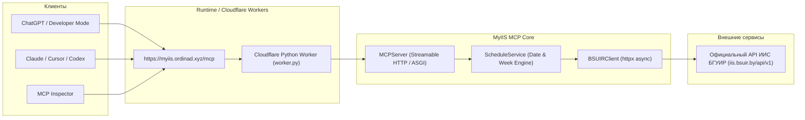

# MyIIS MCP Server

[]()
[]()
[]()
[]()

> **MyIIS MCP** — официальный Model Context Protocol (MCP) сервер, предоставляющий ChatGPT, Claude, Cursor, Codex и другим LLM-клиентам доступ в реальном времени к расписанию занятий, учебным неделям, группам и преподавателям Белорусского государственного университета информатики и радиоэлектроники ([ИИС БГУИР](https://iis.bsuir.by/api)).

---

## 🏛 Архитектура

MyIIS MCP спроектирован как полностью самостоятельный, ультратонкий и асинхронный адаптер между протоколом **Streamable HTTP MCP** (требуемым OpenAI / ChatGPT Developer Mode) и открытым REST API ИИС БГУИР:



### Ключевые принципы архитектуры:
- **100% Standalone**: сервер полностью автономен, не зависит от сторонних сайтов или портфолио, имеет свой собственный жизненный цикл и репозиторий.
- **Serverless & Stateless**: сервер не хранит персистентного состояния между запросами, идеально работает в Cloudflare Workers, Vercel Serverless или контейнерах.
- **Официальный MCP Python SDK 2.x**: полная реализация спецификации Streamable HTTP, `structuredContent`, аннотаций безопасности (`readOnlyHint: true`, `destructiveHint: false`, `openWorldHint: false`) и строгих Pydantic-схем `outputSchema`.
- **Нормализация данных**: вместо громоздких "сырых" JSON-ответов БГУИР сервер формирует компактные, строгие модели `NormalizedLesson`, оптимизированные для контекста языковой модели и будущего MCP Apps UI.
- **Интеллектуальный расчет недель**: сервер автоматически вычисляет 4-недельный цикл БГУИР (недели 1, 2, 3, 4) для любой целевой даты («сегодня», «завтра», произвольная дата) на основе текущей учебной недели университета.

---

## 🛠 Доступные MCP Tools

Все инструменты строго `read-only` и не изменяют состояние внешней системы.

| Tool | Описание | Основные аргументы |
|------|----------|-------------------|
| `get_group_schedule` | Получить расписание учебной группы (на день, диапазон дней или всю неделю) | `group` (номер группы), `date` ('today', 'tomorrow', 'ГГГГ-ММ-ДД'), `days` (1-14), `subgroup` (1 или 2) |
| `get_teacher_schedule` | Получить расписание занятий преподавателя по фамилии или urlId | `teacher` (фамилия или urlId), `date`, `days` |
| `search_groups` | Поиск учебных групп по номеру, специальности или факультету | `query` (строка поиска), `course` (1-5), `faculty` (аббревиатура) |
| `search_teachers` | Поиск преподавателей по фамилии, имени или кафедре | `query` (ФИО), `department` (кафедра) |
| `get_current_week` | Получить текущую учебную неделю БГУИР (1-4) и сегодняшнюю дату | *без аргументов* |

### Структура ответа занятия (`NormalizedLesson`):
```json
{
  "subject": "ЭМП",
  "subject_full_name": "Эргономика мобильных приложений",
  "lesson_type": "ЛК",
  "start_time": "08:30",
  "end_time": "09:55",
  "date": "2026-09-07",
  "day_of_week": "Понедельник",
  "week_numbers": [1, 3],
  "subgroup": 0,
  "auditories": ["112-3 к."],
  "building": "3",
  "teachers": ["Василькова А. Н."],
  "groups": ["310101"],
  "note": null
}
```

---

## 💬 Примеры запросов к ChatGPT

После подключения MyIIS MCP в ChatGPT пользователь может обращаться на естественном языке:

- *«Какое расписание у группы 310101 на сегодня?»*
- *«Какие пары завтра у 310101 для 1-й подгруппы?»*
- *«Покажи расписание занятий преподавателя Васильковой на понедельник»*
- *«Какая сейчас идет учебная неделя в БГУИР?»*
- *«Найди группы факультета ФКП по специальности ИСиТ»*
- *«Кто ведет занятия на кафедре ПОИТ?»*

---

## 💻 Локальная установка и запуск

### Требования
- Python 3.12+
- `uv` или стандартный `pip`
- Node.js 18+ (для запуска MCP Inspector)

### 1. Клонирование и установка зависимостей
```bash
git clone https://github.com/OrDinaD/myiis-mcp.git
cd myiis-mcp

# Создание виртуального окружения и установка
uv venv .venv
source .venv/bin/activate
uv pip install -e ".[dev]"
```

### 2. Запуск тестов
```bash
pytest
```

### 3. Локальный запуск сервера
```bash
uvicorn myiis_mcp.server:app --host 127.0.0.1 --port 8000 --reload
```

После запуска доступны эндпоинты:
- Healthcheck: `http://127.0.0.1:8000/health`
- Server Discovery: `http://127.0.0.1:8000/`
- Streamable HTTP MCP Endpoint: `http://127.0.0.1:8000/mcp`

### 4. Тестирование через официальный MCP Inspector
Запустите интерактивный интерфейс MCP Inspector:
```bash
npx @modelcontextprotocol/inspector
```
В открывшемся браузере выберите transport: **Streamable HTTP**, URL: `http://127.0.0.1:8000/mcp`.

Либо через CLI с проверкой соответствия спецификации (`--strict`):
```bash
npx @modelcontextprotocol/inspector --cli --transport http --server-url http://127.0.0.1:8000/mcp --method tools/list --strict
```

---

## 🚀 Хостинг на Cloudflare Workers

Репозиторий готов для развертывания в Cloudflare Workers с поддержкой Python:

- В проекте настроен `wrangler.toml` с флагом `python_workers`.
- Точка входа `worker.py` использует нативный ASGI-мост Cloudflare (`workers.asgi`).

### Деплой через Wrangler CLI:
```bash
npx wrangler deploy
```

### Автоматический деплой через GitHub:
1. В панели управления **Cloudflare Dashboard** перейдите в **Workers & Pages** → **Create application**.
2. Подключите репозиторий `OrDinaD/myiis-mcp`.
3. Каждый push в ветку `main` будет автоматически собирать и деплоить сервер на ваш домен (например, `myiis.ordinad.xyz`).

---

## 🤖 Подключение в ChatGPT Developer Mode

1. Откройте ChatGPT (с активной подпиской Plus / Team / Pro).
2. Перейдите в **Settings** → **Security and login** → включите **Developer mode**.
3. Откройте [chatgpt.com/plugins](https://chatgpt.com/plugins) или меню плагинов.
4. Нажмите **Add an MCP server** (+).
5. Задайте имя: `MyIIS`.
6. В поле **Server URL** укажите адрес вашего сервера:
   ```text
   https://myiis.ordinad.xyz/mcp
   ```
7. ChatGPT подключится по протоколу Streamable HTTP, считает манифест инструментов (`tools/list`) и сделает расписание доступным в чате.

---

## 🔮 Phase 2 — MCP Apps UI (Interactive Schedule Widget)

В соответствии со спецификацией **OpenAI Apps SDK** и **MCP Apps** (`@modelcontextprotocol/ext-apps`):
- Следующим этапом запланировано внедрение интерактивного виджета расписания (Schedule Widget), который будет визуализироваться прямо в окне диалога ChatGPT в виде карточки расписания (календарь, сетка пар, переключение учебных недель 1-4, подсветка аудиторий и текущего занятия).
- Архитектура `myiis_mcp` уже полностью подготовлена:
  - Все инструменты возвращают строго типизированный `structuredContent`.
  - В `_meta` инструментов будет прикреплен ресурс `ui://widget/schedule.html`.
  - Виджет будет использовать двусторонний мост `window.openai` для адаптации темы и пользовательских фильтров.

---

## 🔮 Phase 3 — Сохранение группы и персонализация

- Использование ChatGPT Memory для автоматического запоминания номера группы студента.
- Опциональная авторизация (OAuth) для доступа к оценкам, рейтингу и ведомостям из личного кабинета ИИС БГУИР.

---

## 📄 Источник данных и лицензия

- Данные предоставляются открытым API Интегрированной Информационной Системы БГУИР: [iis.bsuir.by/api](https://iis.bsuir.by/api).
- Код проекта распространяется под лицензией **MIT**. Автор: [Vladislav Vasilevskiy](https://github.com/OrDinaD).
